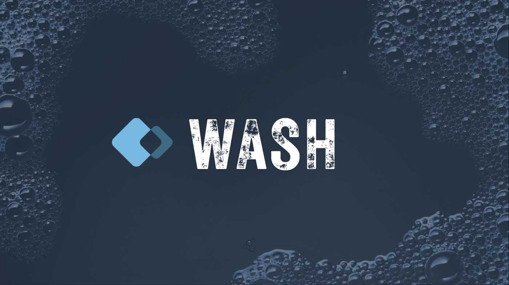

**Clean agent tool output. Lower token burn.**

A Claude Code plugin that replaces the harness's built-in file and shell tools with structured
equivalents that return only what the model needs. The default `Read`/`Edit`/`Write`/`Grep`/
`Glob`/`NotebookEdit` tools dump full files, full directories, and full shell logs into the
model's context. relaywash returns ranked snippets, signature views, parsed errors, and
truncated diffs instead.

## Install

```
/plugin marketplace add AgentWorkforce/wash
/plugin install relaywash@agentworkforce
```

That's it. relaywash takes effect on the next session: the active agent has built-in file
tools disabled, and the MCP server exposes the structured replacements.

## What's in the box

| Tool | Replaces | Notes |
|------|----------|-------|
| `relaywash__Search` | Glob + Grep + Read | Ranked snippets across matched files. One call where vanilla takes ~9. |
| `relaywash__Read` | Read | AST-aware: signatures mode for known languages, mtime cache, range follow-ups. |
| `relaywash__Edit` | Edit | Batched multi-file edits with whitespace/Unicode fuzzy matching, atomic per file, tree-sitter post-check. |
| `relaywash__GitState` | git status/diff/log/show | Structured: file lists + summary stats; per-file diffs truncated. |
| `relaywash__TestRun` | pnpm test / pytest / jest / go test / cargo test | Counts + failed-test summaries. Use `getFailureLog` to drill into one failure. |
| `relaywash__Build` | tsc / cargo / go / pnpm build | One line on success; parsed `errors[]` on tsc/cargo/go failures; `errorTail` otherwise. |
| `relaywash__GhPR` | gh pr view/list/diff + gh api ...pulls... | Field selector; truncated bodies and hunks. |

Each result carries `_meta: { replaces, collapsedCalls }` so `relayburn` (the measurement
side of the project) can attribute savings.

## What's disabled and why

The active agent (`relaywash:code`) has these built-in tools blocked:

- `Read`, `Edit`, `Write`, `Grep`, `Glob`, `NotebookEdit`

A `PreToolUse` safety-net hook also blocks them at the harness level, so even sub-agents
or `/agents` switches can't fall through to vanilla `Read`. `Bash` is still available; a
warn-only hook nudges you toward the structured equivalent when a known shell pattern shows
up (e.g. `git status`, `pnpm test`).

## Measurement

relaywash depends on the [`relayburn-sdk`](https://crates.io/crates/relayburn-sdk) crate
for ledger reads/writes. On every session end, the `Stop` hook calls `sdk::ingest`, which
reads the Claude Code transcript directly — including each tool result's
`_meta: { replaces, collapsedCalls }` annotation — and folds it into the local ledger at
`~/.agentworkforce/burn/` (override with `RELAYBURN_HOME`). To see your savings:

```
/relaywash-savings
```

## Repository layout

```
.claude-plugin/        plugin.json + marketplace.json
.mcp.json              launches bin/wash.mjs (which resolves the native binary)
settings.json          activates the relaywash:code agent
agents/                code (default) + explore (cheap haiku read-only)
hooks/                 PreToolUse / PostToolUse / SessionStart / Stop
scripts/               hook scripts + /relaywash-savings + copy-binary
bin/wash.mjs           Node launcher that resolves the platform binary at runtime
crates/wash/           Rust source — the wash binary
  src/mcp/             minimal MCP server over stdio
  src/tools/           one file per relaywash__ tool
  src/ast/             tree-sitter signature extraction + parses_cleanly
  src/fuzzy.rs         whitespace + Unicode normalization for Edit matching
  src/search.rs        ripgrep-stack search (no shell-out to `rg`)
  src/walk.rs          .gitignore-aware file enumeration
packages/              per-platform npm packages — binaries injected by CI
  wash-darwin-arm64/
  wash-darwin-x64/
  wash-linux-arm64/
  wash-linux-x64/
  wash-win32-x64/
fixtures/corpus/       recorded sessions for burn-compare
docs/                  including compaction-attribution.md
```

## Distribution

Single channel: **npm**, using the `optionalDependencies` pattern (esbuild / swc / rolldown / agent-relay all do this):

- Wrapper package `relaywash` ships only the launcher (`bin/wash.mjs`). Its `optionalDependencies` list five platform-specific siblings.
- Per-platform packages (`@relaywash/wash-{platform}-{arch}`) each carry one prebuilt binary in `bin/`. Each declares `os` / `cpu` so npm installs only the matching one per machine.
- The launcher resolves the platform package via `require.resolve` at runtime and execs the binary. Falls back to `target/release/wash` for local dev. `RELAYWASH_BIN` overrides everything.
- CI (`.github/workflows/release.yml`) builds the binary on each target platform on tag push, then publishes the five platform packages plus the wrapper to npm at the same version.

The plugin's `.mcp.json` calls the launcher script directly:

```json
{
  "command": "node",
  "args": ["${CLAUDE_PLUGIN_ROOT}/bin/wash.mjs", "mcp"]
}
```

After publishing, end users who don't pull the plugin source can also run via npx:

```json
{
  "command": "npx",
  "args": ["-y", "relaywash", "mcp"]
}
```

## Hacking

```
cargo build --release       # produces target/release/wash
cargo test --release        # unit + MCP stdio integration tests
target/release/wash mcp     # run the MCP server manually for poking

node bin/wash.mjs --version # smoke-test the launcher
node scripts/copy-binary.mjs # stage the local binary into the host platform package
```

Pre-commit safety: `cargo test --release` exercises the parsers, the MCP framing, and a stdio integration test that spawns the binary and lists tools. CI (`.github/workflows/ci.yml`) runs the same plus a layout sanity check on each platform package's `package.json`.

Hooks are Rust subcommands invoked through the launcher: `node bin/wash.mjs hook <kind>` (where kind ∈ `builtin-block`, `tool-redirect`, `edit-batching-nudge`, `post-tool-observe`, `session-start`, `session-stop`). The `/relaywash-savings` slash command calls `wash savings --session …` directly.

## Adaptive layer substrate ([wash#13](https://github.com/AgentWorkforce/wash/issues/13))

PR 7 lays the groundwork for per-repo tuning derived from observed tool-call patterns. Today it ships only the *substrate* — there's no aggregator yet, no profile gets written automatically, and no behavior changes:

- **Observation hook.** `wash hook post-tool-observe` runs PostToolUse on every `mcp__relaywash__*`. It captures tuning-relevant args (counts, modes, runner/builder selectors), the result's byte size, a Search-specific `hitCap` flag, and `prevTool` / `prevSameArgs`. Events stream to `${RELAYBURN_HOME}/observe/<session>.jsonl`; per-session state lives at `${RELAYBURN_HOME}/observe-state/<session>.json`. Sensitive fields (paths, file contents, search needles, edit text, PR bodies) are stripped via a per-tool allowlist before logging. Writes are best-effort — any failure is logged and dropped so the hook never blocks the user's tool call.
- **Stop-hook ingest.** On session end, the Stop hook calls `relayburn_sdk::ingest`, which reads the Claude Code transcript directly — including each tool result's `_meta: { replaces, collapsedCalls }` — and folds turn-level token totals (cache read/creation, input, output) into the SQLite ledger. Replaces the old in-tree `session_summary` event.
- **Profile loader.** `src/profile.rs` reads `${RELAYBURN_HOME}/profiles/<repoKey>.json` (per-repo) or `_global.json`. The repo key is derived from the git remote URL (or cwd) hashed with FNV-1a for a filename-safe slug. `Search` and `Read` consult this profile for their applied defaults — but the JSON `inputSchema` the agent sees is byte-stable across profile values. An end-to-end integration test (`tools_list_is_byte_stable_across_profiles`) asserts that, protecting Anthropic's 5-min prompt cache from invalidation when the adaptive layer eventually starts tuning defaults.
- **`settings.json`** carries a `wash.learning` block: `mode` (default `off`), `scope` (`per-repo`), `minObservations` (20), `experiment` (`false`). Defaults are conservative; the loader honors them once the aggregator lands.

The aggregator, the `learn-aggregate` / `learn-compare` subcommands, the `/wash-learn-*` slash commands, the in-session adaptation mode, and the bash pattern auto-discovery are deliberate follow-ups. The wash#13 spec asks for observation to land first so the aggregator has real data to design against — that's what PR 7 ships.

## License

MIT.
